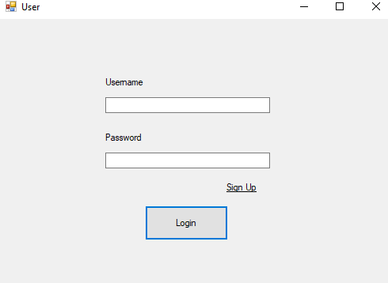
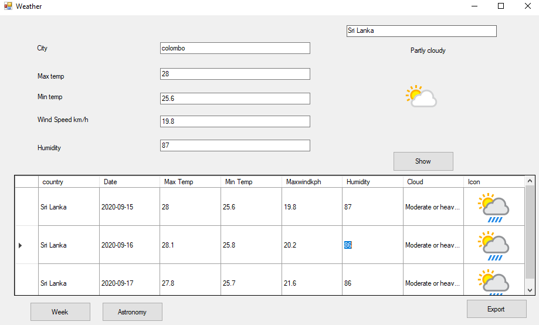

# Bookmark (STAR) My Project if it's useful.
# Weather

  

  

# Description
The Weather for is a system that is made from visual studio as selected with .NET C#. This application uses WinForms as well as a weather API to get the essential data for an output. The application has the option for a user to login and to be able to sign up a new user. All the user’s information is connected to the MYSQL database.
The Weather Application is made containing three WINFORMs:
*	USER Form
The user form is the main form that appears once we run the application. It gives the user to enter their username and password. It also has the option to register a user to the system.
*	REGISTER Form
The register form is appeared once the user clicks the signup option in the user form. It contains the detail boxes for the user to enter the data which will be saved once the create account button is clicked. 
*	WEATHER Form
The weather form is appeared after the user enters their correct username and password. The weather form has the detail for the forecast, it can display the current information and the weekly. An addition to it is that astronomy details are displayed as well. And the last option is for it to export those details into an excel file.

# Code Description
In the WORD document as "Code.docx"

# Installation
Install Visual Studio in PC, and run the file "weatherTrail.sln" in the folder "WeatherTrail". 
### Database
As well as run the database in a local server such as WAMP, XAMP and etc. Create a DB in the name of "users" and import the SQL file into it. 
Then connect the database from Visual Studio to the Server.
### API
The API key is usuable. However, if is case it is not active, make one of your own from host and replace it.

# Developed by
MOHAMMED REZAAN RIYAZ
